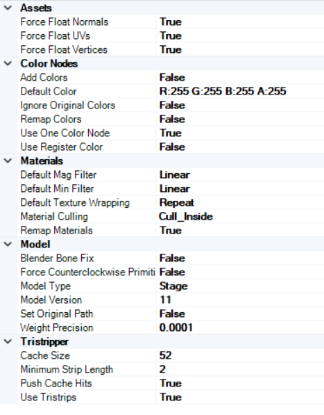

# KCL Visible Collision Tool

A python program for automatically making Mario Kart Wii .szs files with visible, colored collisions.

Huge thanks to [Epik95](https://github.com/Epik95mkw) for his [manual tutorial](https://www.dropbox.com/scl/fo/36pjicleqj7ilsdfzpocr/AO93sa02dgbczOQBws9u3cU?rlkey=y0a6b5s8jaxsf1xah9dx8n3iz&st=aoeyayp1&dl=1),
i basically just automated his stuff,
 
And to [Gabriella](https://github.com/Gabriela-Orzechowska) for the color conversion script, the [Blender plugin to open SZS files](https://github.com/Gabriela-Orzechowska/Blender-MKW-Utilities) and additional things from Epik's tutorial.

## Installing
Install the .zip from the latest release, extract it where you want (it will also extract additional files other then the .exe) and run `Tool.exe`.

## Requirements
> [!NOTE]
> Some stuff like automatic installation of Blender and BrawlCrate might not work as its not tested properly yet.

This uses [Blender](https://www.blender.org/) and [BrawlCrate](https://github.com/soopercool101/BrawlCrate) (and their respective APIs) for automating this process, which means you need to have these programs installed locally on your PC.
 
(i might someday tranfer this to a website with a server for both programs)
 
Gabriela's plugin currently only works with 3.x versions of Blender, so i suggest [Blender 3.6 LTS](https://www.blender.org/download/lts/3-6/).
 
I also provide an automatic installation for both.
## Usage
Once you run the program, enter the paths of the programs (be sure to put the actual .exe and not the folder) on the top and your file on the filebox.
 
Click the run button, you should see a window popup after a bit. Since BrawlAPI doesnt yet have automation for this, you need to manually set those options like [the following](brawlcrate_import_settings.png) (you need to do it only the first time):
 

 
After that just download the result where you want.

## Building
Since python is an interpreter language, i use Pyinstaller to compile main.py
 
Run `pip install pyinstaller` and `pyinstaller --onefile --clean main.py` to make main.py an executable.
 
You should also move the .exe which has been created to the /dist folder on the root, and delete the /build folder

